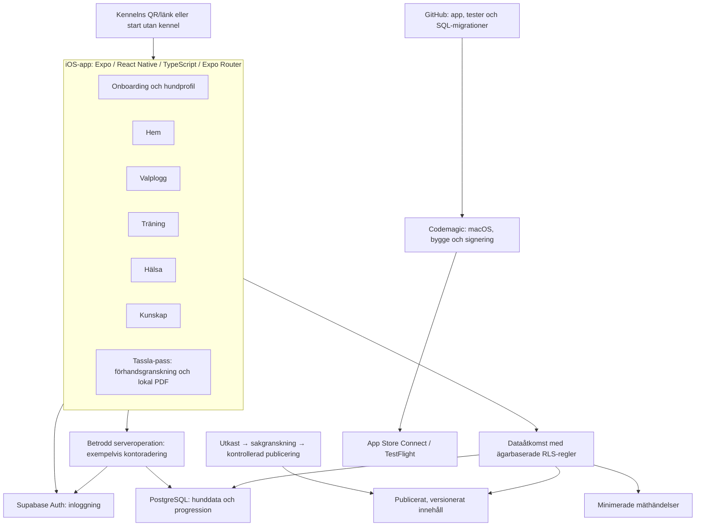
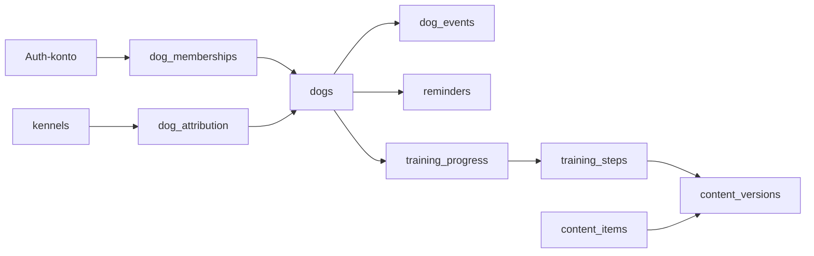

# Tassla – arkitekturförslag för MVP

Datum: 2026-10-04. Status: **arkitektur accepterad av Erik 2026-10-04**: ”Ok, jag godkänner Architecture.md. Skapa filerna för nu, samt de SQL-kommandon jag ska köra”. Godkännandet omfattar lokal projektgrund och SQL-filer för ny Supabase-utvecklingsmiljö; ingen extern release eller datainsamling aktiveras.
Tech Lead för detta steg: **GPT-6 Astra**, på Eriks uttryckliga begäran. Ordinarie rollkonfiguration är oförändrad.

## Utgångspunkt och rekommendation
Erik har godkänt MVP och kärnstack. Leveransen följer övre delen av vision_rev01.jpg: Hem, Valplogg, Träning, Hälsa, Kunskap och enkelt Tassla-pass. Onboarding, QR-distribution, påminnelser och mätning stödjer dessa områden. Treårsvisionen ingår inte.

Rekommendationen är **en Expo-app och Supabase som gemensam backend**. Ingen egen generell API-server, mikrotjänstarkitektur eller administratörsportal behövs för identifierat MVP-behov. Avgränsade serveroperationer används där klienten saknar säkra rättigheter, exempelvis kontoradering. Alternativet med en separat backend ger central speciallogik men extra utveckling/drift utan konkret behov nu.

Öppna detaljval blir inte automatiskt beslutade genom stackgodkännandet. Dokumentet installerar inga dependencies, aktiverar ingen tjänst och godkänner inte faktisk datainsamling eller release.

## Systemöversikt

Diagrammet visar föreslagna ansvar, inte fungerande integrationer. Notifieringsleverans och eventuell offlinekö konkretiseras efter respektive beslut. Codemagic-kedjan ska verifiera Expo prebuild, signering och installation på fysisk iPhone; molnbyggen ersätter inte alla Mac/Xcode-behov. [Codemagic React Native](https://docs.codemagic.io/yaml-quick-start/building-a-react-native-app/)

## Vad appens delar gör
| Del | Ansvar |
|---|---|
| Onboarding/profil | Konto, valfri kennelkälla, hundens namn/ras/födelsedatum och permanent ID |
| Hem | Åldersanpassad hjälp, relevanta träningssteg och nästa handling |
| Valplogg | Snabb registrering, historik, rättning och radering |
| Träning | Två–tre granskade program med sparad progression |
| Hälsa | Ägarregistrerad vikt, vaccinationer, veterinärhändelser och kommande datum |
| Kunskap | Artiklar, guider och checklistor från samma källa som Hem |
| Tassla-pass | Förhandsgranskning och lokal PDF av beslutat urval |
| Gemensamt stöd | Behörighet, sparstatus, tillgänglighet, påminnelser, mätning och kontoradering |

Sex områden betyder inte sex navigationstabbar. Navigationsplanen ska prioritera snabb åtkomst och bildens visuella riktning. Ett litet gemensamt designsystem definierar varm bas, tydlig accent, läsbar typografi, tillstånd och korta rörelser. Tryckrespons är omedelbar, med reducerad rörelse och tillgänglighet enligt docs/dev/ui-and-code-standards.md. Sparad-status kräver serverbekräftelse eller uttryckligen märkt lokal kö.

## Datamodell och ägarskap
Vanliga relationstabeller med främmande nycklar, datatyper och villkor. Ingen generell JSON-behållare för all produktdata. Tabellen är en ansvarskarta; detaljerat schema granskas per segment och skapas genom migrationer när det behövs.

| Föreslagen tabell | Innehåll och relation |
|---|---|
| Auth-konto | Supabase hanterar konto; ingen dubblerad användarprofil utan konkret behov |
| `dogs` | Permanent ID, namn, ras, födelsedatum; ålder beräknas |
| `breeds` | Litet kontrollerat rasurval med blandras/okänd; ingen komplett rasprodukt |
| `dog_memberships` | Hund ↔ konto och roll; endast en ägare per hund i pilot |
| `kennels` | Distributionskälla och aktiv kod; inget valpköparregister |
| `dog_attribution` | Hund ↔ verifierad initial distributionskälla |
| `dog_events` | Hund, aktör, händelsetyp, datum/tid och typade fält för logg/vikt/vårdhändelser; databasvillkor styr giltiga fält |
| `reminders` | Hund, ägarangivet datum och relevant mål; kanalberoende fält senare |
| `content_items` | Stabil identitet för artikel, guide, checklista eller program |
| `content_versions` | Version, text, åldersintervall, källor, granskning/publicering |
| `content_breed_targets` | Rasurval enbart när det faktiskt påverkar innehållet |
| `training_steps` | Programversion, stabilt steg-ID, ordning och instruktion |
| `training_progress` | Hund + programversion + steg + genomförandetid; unik kombination |
| `product_events` | Vitlistade mäthändelser, tid och minsta nödvändiga kohortkoppling |


Hund och ägarmedlemskap skapas atomärt i en avgränsad databasoperation. Klienten får inte fritt lägga till ägare eller överta en hund. RLS (databasens åtkomstregler) kontrollerar läsning, skapande, ändring och radering via aktuellt medlemskap; även flytt av poster till annan hund skyddas. Privilegierade nycklar hör enbart hemma i betrodd servermiljö. [Supabase RLS](https://supabase.com/docs/guides/database/postgres/row-level-security)

Kennelkod ger **ingen åtkomst till ägare, hund eller mätdata**. Flerhunds-/delningsmodell kan byggas vidare på senare; användargränssnitt och behörigheter för det byggs inte nu. Kommande datum skiljs från genomförda händelser. Datum utan klockslag behåller datumsemantik; tidszoner fastställs inför notifieringar och mätning.

## Innehåll och progression
Hem och Kunskap använder samma publicerade innehållsversioner. Urval börjar med ålder och där sakligt motiverat ras; ingen AI-personaliseringsmotor behövs. Utkast → sakgranskning → publicering enligt AGENTS.md. Ägarkonton får inte publicera eller läsa utkast; skyddet omfattar träningssteg och eventuell media, inte bara huvudposten.

Publicerade versioner ändras inte; rättelse ger ny version. Progression binds till påbörjad programversion. Nya steg markeras aldrig automatiskt som genomförda. Osäkert indraget innehåll slutar visas även i pågående program; progression bevaras och en granskad väg vidare behövs. Ingen tyst omtolkning av tidigare genomföranden.

Förslag: granskade filer och en kontrollerad import/publiceringsprocess som Erik använder under pilot. Processen måste byggas. Om en copywriter behöver självständig publicering före pilot beslutas CMS, behörigheter och budget först; Sanity är ingen automatiskt vald komponent.

## PDF, offline och notifieringar
**Tassla-pass:** föreslaget första urval är grundprofil och registrerad vaccination/veterinärhändelse/vikt. Erik fastställer fälten före implementation. Ägaren förhandsgranskar och skapar PDF lokalt, med datum och markering att uppgifterna är ägarregistrerade. Ingen serverlagrad PDF eller publik länk. Exporten ska inte hämta externa typsnitt/bilder eller utlösa spårning. Användartext behandlas säkert. Expo stöder PDF-generering; exakt modul och version kräver uppgiftsbeslut före installation. [Expo Print](https://docs.expo.dev/versions/latest/sdk/print/)

Tillfälliga exporter städas när mottagande system inte längre behöver dem, vid återstart efter avbrott och kontobyte. Tidpunkten verifieras på iPhone. Tassla kan inte radera kopior ägaren själv lämnat till andra appar.

**Offline, öppet:** internetberoende första övervakade segment rekommenderas för enkel start. Det väljer inte pilotens offlinekrav. Om begränsad offline väljs: beständig lokal loggkö/cache, unika händelse-ID:n, idempotenta återförsök, väntande status, kontoavskild lagring och regler för rättning/radering. Börja med nya vardagsloggar; ange nätkrav för övriga operationer. SQLite ger inte synk automatiskt. Ingen automatisk bakgrundssynk utlovas.

**Påminnelser, öppet:** lokal notis eller fjärrpush kräver kanalbeslut. En rad i appen är inte en levererad pushnotis. Hälsodatum är ägarangivna, inte automatiskt härledda behandlingsscheman. Behörighet, av/på-val och koppling till rätt vy måste verifieras.

**Loggens beteende vid fel:** ge omedelbar tryckrespons men visa väntande tills resultatet är bekräftat. Ett loggförsök har samma händelse-ID genom återförsök så att dubbeltryck/timeout inte ger dubbletter. Vid okänt serverresultat kontrolleras samma ID innan nytt försök; visa ”sparstatus okänd” med möjlighet att kontrollera/återförsöka, aldrig falskt ”sparat”. Utan godkänd beständig offlinekö lovas inte att ett ofärdigt försök överlever appstängning. Exakta scenarier för dubbeltryck, nätfel och timeout fastställs/testas före loggsegmentet.

## QR och mätning
Kennelkod verifieras serverledes. Återöppnad länk eller explicit kod är reserv efter installation; en vanlig QR-länk garanterar inte bibehållen kontext. Testa med appen oinstallerad. Ingen uppfödarportal behövs.

Före inloggning föreslås manuellt antal utdelade inbjudningar och, om godkänt, summerade länk-/onboardingstarter per kennel. Ingen beständig enhetsidentifiering som standard. Individuell konvertering före/efter konto kan då inte bevisas; begränsningen redovisas.

Efter inloggning används godkänd eventlista för hund skapad, Hem visat, logg, träning och meningsfull återkomst. Inga namn, e-postadresser, fritexter eller vårduppgifter i analysdata. Kontokopplade event är fortfarande personuppgifter. Ingen användare får skriva andras event eller läsa samlade pilotdata. D1/D7/D30, tidszoner och kohorter definieras före mätning. Compliance/Erik beslutar dataändamål, rättslig grund, information, lagring och eventuellt samtycke före insamling.

## Konto, radering och drift
Erik har valt e-post med engångskod för första versionen, 2026-10-04. Google-inloggning planeras senare som separat authutökning. Se docs/decisions/0003-auth.md. Ingen egen authlösning; sessionslagring, mejlleverans och mobilflöde återstår att implementera/verifiera.

Kontoradering initieras i appen och utförs genom betrodd serveroperation med autentisering/bekräftelse. Radera konto, medlemskap, ensamägd hund, händelser, progression, påminnelser, attribution och identifierbara mäthändelser; operationen ska kunna återupptas efter fel. Testa att tidigare utfärdad session inte kan återskapa data. [Apple kontoradering](https://developer.apple.com/support/offering-account-deletion-in-your-app/), [Supabase användarhantering](https://supabase.com/docs/guides/auth/managing-user-data)

Utloggning/kontobyte/radering tömmer privat cache, session, eventuell kö och exporter; osynkade data kräver tydlig hantering. Lokal återställning är skild från serverradering. Backupretention och återapplicering av raderingar efter återställning dokumenteras; omedelbar fysisk radering ur backuper utlovas inte. [Supabase backups](https://supabase.com/docs/guides/platform/backups)

Erik beslutar bygg-/driftbudget, backupnivå, testutrustning och pilotmiljö. Utvecklings-/pilotdata separeras. Börja med liten innehållsmängd, paginerad historik och kontrollerad byggfrekvens; större användarantal motiverar mätning av last/kostnad innan extra komponenter införs. Ingen partner är lanseringsberoende.

## Föreslagen filstruktur
```text
app/                         Expo Router-vyer och navigation
src/
  features/
    onboarding/  home/  puppy-log/  training/
    health/  knowledge/  passport/  account/
  components/                Små gemensamma UI-komponenter
  theme/                     Färg, typografi, avstånd och rörelse
  data/                      Supabase-klient och konkreta dataoperationer
  content/                   Innehållsurval och versionskontrakt
  analytics/                 Godkänd eventlista
supabase/
  migrations/                Schema, villkor och åtkomstregler
  functions/                 Endast nödvändiga serveroperationer
tests/                       Beteende-, behörighets-/integrationstester
docs/                        Guider, beslut, planer och checkpoints
codemagic.yaml               Skapas med godkänd bygguppgift
```
Detta är en ansvarskarta, inte scaffolding. Mappar/filer skapas först när en uppgift behöver dem. Små funktioner med ett ansvar; konkret dataåtkomst utan generiskt repository-ramverk. SQL-migrationer är schemakälla; TypeScript-typer matchar verkligt schema. Varje modul får kort README/guide, enkel konsekvent namngivning och aktuell versionsanpassad dokumentation.

## Föreslagen byggordning
| Segment | Fungerande leverans |
|---|---|
| 1 | Minimal grund och tidigt verifierad Codemagic-byggkedja; konto → hundprofil → Hem, ägarisolering och granskat innehåll |
| 2 | Logg → historik → rättning/radering med beslutad offlinepolicy |
| 3 | Träningssteg → genomförande → återupptagen versionsbunden progression |
| 4 | Hälsoregistrering → historik → ägarangivet kommande datum |
| 5 | Kunskap från gemensam publicerad källa |
| 6 | Förhandsgranskning → PDF → verifierad städning |
| 7 | Sammanhängande pilot med QR, mätning, notifieringar, kontoradering och TestFlight |

QR, mätning och kontoradering planeras tidigt; sista segmentet är slutverifiering, inte första tillfället att upptäcka kraven. Varje segment bryts i små deluppgifter före start. En aktiv uppgift som standard, högst två med skilda skrivområden. Erik ger segmentmandat; Architect granskar exakt planversion. Relevant Compliance/Security-granskning krävs. Efter större del: avgränsad städning, nya kontroller, QA, oberoende Reviewer och checkpoint med exakt nästa steg. Ingen nattlig scheduler är aktiverad.

Testa två konton med negativa behörighetstest, nätfel, innehållsindragning, progression, radering med gammal session och fysisk PDF-/TestFlight-resa. Mockar ersätter inte faktisk integration. Appens check-kommandon fastställs med första grundsegmentet.

## Öppna detaljbeslut och omprövning
1. E-postleverans och säker sessionslagring; metodvalet (e-post/engångskod) är beslutat.
2. Pilotens offlinepolicy och lokala dataskydd.
3. Notifieringskanal och konkret pilotkrav.
4. Redaktionell process/CMS och granskat innehållsurval.
5. Exakta PDF-fält.
6. Mätdefinitioner, attribution, databehandling och lagring.
7. Budget, backup, miljöer och testutrustning.
8. Dependency-versioner och första segmentmandat.

Dessa upphäver inte det lämnade MVP-/stackgodkännandet. Arkitekturen minskar driftkomponenter men kräver arbete med SQL, rättigheter, publicering, radering och mobiltestning. Klientbyte är dyrt; ordnad SQL och innehållskontrakt underlättar framtida flytt. Auth/drift måste ändå migreras separat. Omfattande offline, delad åtkomst eller djupa iOS-krav motiverar ny arkitekturgranskning.

### När besluten behövs
| Beslut | Måste vara fastställt före |
|---|---|
| Authmetod, testmiljö, innehållsprocess och första urval | Segment 1 använder konto/innehåll |
| Byggbudget och signering | Byggtjänst aktiveras; fysisk testtelefon innan device-verifiering |
| Offlinepolicy och nätfelsbeteende | Segment 2 startar; lokal lagring planeras tidigare om den påverkar grundsegmentet |
| Programurval och sakgranskning | Segment 3 publicerar verkligt innehåll |
| Hälsofält, dataändamål och datumsemantik | Segment 4; ingen riktig data innan relevant godkännande |
| PDF-fält och export/dataregler | Segment 6 |
| Notifieringskanal | Första notifieringsuppgiften, senast före relevant del av Hälsa/segment 7 |
| Mätdefinitioner, attribution och databehandling | Första mät-/QR-uppgiften, även om den läggs i segment 1 |
| Driftbudget, backup och raderingsrutiner | Riktig pilot; kostnad/tjänsteaktivering beslutas tidigare vid behov |
| Dependency-versioner och segmentmandat | Respektive implementation startar |

Critic: **PROCEED WITH CHANGES**, 2026-10-04. Kompletteringarna ovan anger beslutens tidpunkt och loggens nätfelsbeteende. Detta är dokumentgranskning, inte verifiering av fungerande kod.

Verifieringsunderlag: Astra läste projektunderlag och officiella källor 2026-10-04. Ingen prototyp, installation eller fungerande integration har verifierats. Projektets check är fortfarande odefinierat. Critic-resultat sparas i docs/tasks/architecture-proposal.md.
