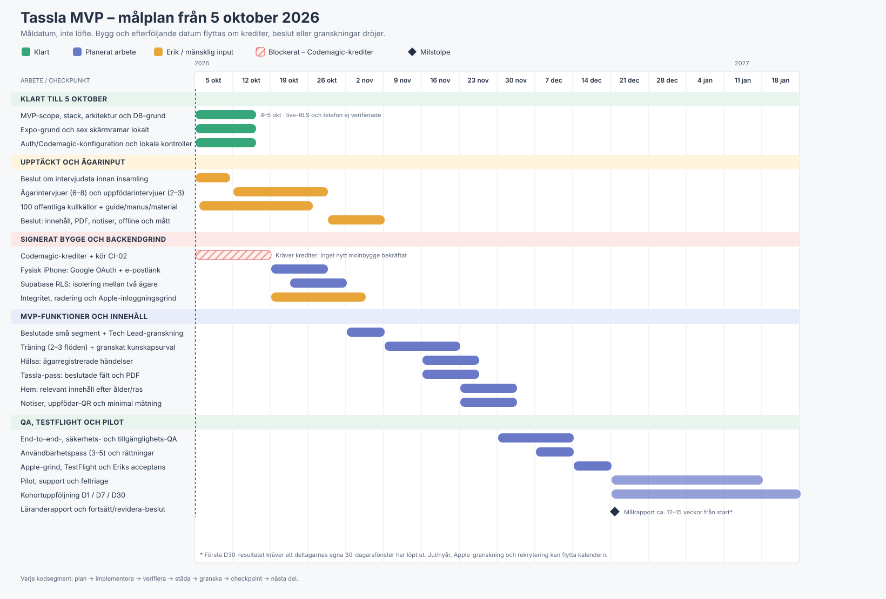

# Tassla MVP – Gantt-schema och checklista

**Planeringsdatum:** 2026-10-05  
**Status:** arbetsplan; framtida datum är mål och flyttas om en grind eller mänsklig input dröjer.  
**Scopekälla:** [`docs/mvp.md`](../mvp.md), godkänd 2026-10-04.  
**Detaljerad uppskattning:** [`mvp-tidplan.md`](mvp-tidplan.md).  
**Uppfödarintervjuer:** [`breeder-interviews-pilot.md`](breeder-interviews-pilot.md).

Planen räknar med en eller högst två aktiva deluppgifter åt gången, cirka 20–30 fokuserade agenttimmar per vecka när arbetet kan köras, mänskliga svar inom 24–48 timmar och inga nya funktioner utanför godkänd MVP. Uppskattningen är inte en garanti. Erik har uppgett att Codemagic-krediterna är slut; därför är första nya signerade iPhone-bygget en **blockerad grind** och alla beroende datum nedan är preliminära. Återstående arbete uppskattades tidigare till 122–206 agenttimmar, med cirka 7–9 veckor till pilotbar hel MVP och 12–15 veckor till första D30-beslut när arbetet kan fortgå.

## Aktuell genomförandestatus — 2026-10-06
Den äldre daterade tidslinjen nedan är ett historiskt estimat. Eriks nya beställning och telefonpolicy i [samlad paketplan](dev/mvp-beta-delivery.md) gäller framför tidigare interpaketgrindar: Erik väljer kritiska telefonprov, lokal implementation fortsätter utan automatiskt TestFlight-stopp. Ingen ny pilotdag kan härledas enbart från lokal kodstatus.

| Paket | Faktisk status |
|---|---|
| P01 utförd hälsa, P02 profil, P03 planerad hälsa | Lokalt klara och granskade |
| P04 innehåll | Utkast/importverktyg klara; mänsklig sakgranskning/publicering väntar |
| P05 Hem/Kunskap, P06 PDF-pass | Lokalt klara; senaste fullcheck253 och iOS-export PASS |
| P07 påminnelser | DATAQA klar; NATIVE/storage/UI och slutkontroll pågår |
| P08 QR, P09 mätning, P10 beta-konto | Förberedelser; verkliga betauppgifter/databeslut återstår |
| P11 samlad beta-QA | Efter funktionerna; verklig backend/RLS, signerad kandidat och Eriks distributionsbeslut återstår |

[Release-log per paket](../releases/MVP-BETA.md) beskriver implementerat, verifierat och nästa steg. Ogranskade råd publiceras inte. D30-utvärdering börjar först efter verklig aktivering och är inte en bygggrind.
## Gantt-schema

Heldragna datum är målintervall, inte utfästelser om att arbete sker automatiskt. Uppgifter med beroende på iPhone-bygget startar först efter att Codemagic-krediter finns och bygget faktiskt lyckats. Den visuella tidslinjen finns nedan; checklisterna och grindarna följer efter den.

**Datumtolkning:** De första blocken ligger i serie eftersom ett verkligt iPhone- och RLS-prov behövs innan de känsligare funktionssegmenten låses. Inom funktionerna kan deluppgifter ordnas om efter intervjuer och beslut, men ingen ska startas innan dess acceptanskriterier, dataåtkomst och granskare är tydliga. Codemagic-krediter, Apple-behandling och testdeltagare kan flytta datumen utan att agenternas uppskattade fokustimmar ändras.

## Checklista – redan genomfört

- [x] **2026-10-04 – MVP och stack godkända av Erik.** Sex användarområden plus onboarding, distribution och mätning är scope; beslutade avgränsningar finns i `docs/mvp.md`.
- [x] **2026-10-04 – Arkitektur och databasgrund skapade.** Migrationer och syntetiskt grundtest finns. Tidigare testresultat med rollback visar inte att live-RLS är oberoende verifierad.
- [x] **2026-10-04/05 – APP-01/02/03 lokalt genomförda.** Profil, vardagslogg, träningsprogression, Hem/Kunskap-ramar, Google/epostgrund, visionsbaserad UI och Codemagic-konfiguration finns. Hälsa och Tassla-pass är fortfarande tomma grunder. Lokalt resultat bevisar inte fysisk telefon, OAuth-retur eller backendisolering.
- [x] **2026-10-05 – Godkända paket installerade och lokala kontroller körda.** Den senaste lokala kontrollen rapporterades som 40/40, full check och iOS-buntning. Ingen ny betald API-körning behövdes.
- [x] **2026-10-05 – iOS-beroendekonflikten rättad i källträdet.** Reanimated/Worklets-versionerna är nu kompatibla enligt lokala kontrollen; Codemagic-bygget efter rättningen är ännu inte bekräftat.
- [x] **Apple-signering har ett matchande underlag i Codemagic.** Erik visade en App Store-provisioningprofil för `com.erimaliab.tassla` med godkänd certifikatmarkering. Detta bevisar inte att ett arkiv kan byggas eller laddas upp.
- [x] **2026-10-05 – Uppfödarintervju- och pilotrekryteringsplan påbörjad.** Planen anger offentliga källor, inget kontaktutskick, och att rekrytering/intervjudata kräver beslut först.

## Checklista – nästa grindar

### 1. Förbered upptäckt utan att samla in personuppgifter

- [ ] Erik beslutar ändamål, rättslig grund, information till deltagare, lagringstid, åtkomst och radering för intervjuer. Bestäm separat om samtal spelas in; standardplanen ska vara att inte spela in.
- [ ] Erik godkänner intervjuguide/urval efter Product-, Compliance-, Dog Expert- och Critic-granskning enligt uppfödarplanen.
- [ ] Ta fram formulär, samtalsmanus, svarskodning och uppföljningsblad. Den befintliga uppgiften gäller 100 publikt belagda kullannonser; verifiera källor och håll osäkra kandidater åtskilda. Ta ingen extern kontakt utan Eriks uttryckliga uppdrag.
- [ ] Rekrytera och genomför 6–8 intervjuer med nya valpägare och 2–3 uppfödare, 30–45 minuter vardera. Sammanfatta svar avidentifierat; skicka inte råanteckningar till agenter.
- [ ] Erik väljer målgrupp och prioriteringar efter analys. En intervjuperson får inte automatiskt pilotplats.

### 2. Lås produktbeslut och pilotmått

- [ ] Bekräfta piloturvalet: arbetshypotes 2–3 träningsflöden, 8–12 kunskapsobjekt, 2–3 uppfödare och 15–25 ägare.
- [ ] Fastställ åldersfaser och vilka artiklar/checklistor som visas i Hem respektive Kunskap.
- [ ] Erik anger namngiven mänsklig hund-/veterinärgranskare för hälsa, träning och relevanta utfodringspåståenden. AI-granskning ersätter inte sakgranskning.
- [ ] Erik beslutar exakt vilka egna uppgifter Tassla-passets PDF får innehålla och godkänner markering att de är ägarregistrerade och inte officiella.
- [ ] Besluta påminnelsekanal, samtyckes-/valflöde och beteende vid nekade notiser; MVP-specen kräver en notifieringsmotor, medan tidigare önskemål sköt upp push.
- [ ] Besluta vad som måste fungera offline i piloten; dokumentera vad som kräver internet.
- [ ] Definiera aktivering, meningsfull återkomst, D1/D7/D30-fönster och numeriska målnivåer innan mätning börjar.
- [ ] Bestäm uppfödar-QR-data: unik källa per pilotuppfödare, ingen delning av ägarens person- eller hunduppgifter med kennel utan uttryckligt separat samtycke.

### 3. Få igenom signerad iPhone- och backendgrind

- [ ] Erik ordnar Codemagic-krediter eller väntar tills tillgänglig budget medger körning; undvik upprepade byggen innan felorsaken är kontrollerad.
- [ ] Commit/pusha den godkända CI-02-rättningen från Eriks arbetskopia och kör den befintliga Codemagic-workflowen en gång.
- [ ] Kontrollera hela resultatet från dependency-installation till signerad IPA/arkiv och distribution till vald intern testkanal. Byggresultatet måste vara grönt innan telefonverifiering markeras klar.
- [ ] Installera på fysisk iPhone; verifiera Google OAuth callback och e-post engångslänk på den faktiska appen.
- [ ] Verifiera att Google och e-postflödet hamnar på avsett användar-ID, och gör inga första skrivningar förrän ID-/kontobeteendet är förstått.
- [ ] Kör live-Supabase-test med två ägarkonton: skapa och läs hund/logg med ägare A; bevisa att B inte kan läsa, ändra eller radera A:s data. Kontrollera även radering och nekade anrop.
- [ ] Kontrollera Supabase-region, ändamål, dataminimering, RLS, nyckelhantering, backup/radering och loggning. Publicera inga hemligheter i repo, testbilder eller rapport.
- [ ] Erik beslutar appens kontoraderingsflöde och likvärdigt inloggningsalternativ för avsedd Apple-distribution. Granska aktuella Apple-villkor innan uppladdning; magic link ska inte på förhand räknas som likvärdigt med Google.
- [ ] Förbered integritetspolicy, App Store-datadeklarationer och användarinformation utifrån de faktiska dataflödena före extern beta/distribution.

### 4. Färdigställ funktioner, ett godkänt segment åt gången

- [ ] **Hundprofil/onboarding:** namn, ras, födelsedatum, automatisk ålder och permanent ID; äldre hund ska kunna välkomnas utan formuleringen ”Börja med din valp”. Verifiera återstart och fel-/tomlägen.
- [ ] **Hem:** visa ålders-/rasrelevant publicerat innehåll, tydlig nästa handling och länkar till logg/träning/kunskap. Verifiera att inget påhittat demo-innehåll visas.
- [ ] **Vardagslogg:** verifiera kiss, bajs, mat, sömn/vaken och promenad, historik, datum/tid, rättning och radering mot verklig backend och hund-ID.
- [ ] **Träning:** implementera och sakgranska 2–3 korta flöden med tydliga steg, nästa handling, sparad progression och återupptagning. Endast belöningsbaserad metod enligt projektreglerna.
- [ ] **Hälsa:** implementera vikt, vaccination och veterinärhändelser med datum, redigering och radering; kommande datum märks som ägarangivna. Ingen diagnos, behandlingsrekommendation eller härlett kliniskt schema.
- [ ] **Kunskap:** publicera ett litet åldersrelevant urval med källa och mänsklig granskning; samma innehållsversion ska kunna visas i Hem och Kunskap.
- [ ] **Tassla-pass:** skapa ägarinitierad förhandsgranskning och lokal PDF från endast beslutade fält; visa skapandedatum och ägarregistreringsmarkering. Ingen delningslänk eller automatisk överföring.
- [ ] **Påminnelser:** implementera först efter kanalbeslut, med användarens val och djup länk till relevant hjälp. Testa tillåtna, nekade och avstängda notiser.
- [ ] **Uppfödarflöde:** skapa unik länk/QR per pilotuppfödare, onboarding-attribution och mätning från inbjudan till återkomst. Testa onboarding utan uppfödarkod.
- [ ] **Mätning:** registrera minsta beslutade händelser för invite, onboarding, hund skapad, Home, första logg/träning och återkomst. Skicka inga hälsedetaljer/personuppgifter i analysmetadata.
- [ ] **Radering/integritet:** låt användaren initiera konto- och datahantering enligt beslutad produkt- och Apple-grind; verifiera radering genom alla relevanta tabeller och felhantering.

### 5. Kvalitet, TestFlight och pilot

- [ ] QA kör end-to-end på iPhone: ny ägare, hundprofil, Hem, logg, träning, hälsa, kunskap, PDF, påminnelse, återstart, nätverksfel och konto-/dataradering.
- [ ] Security granskar auth, persondata, åtkomstpolicy, nätverk, export, analytics och tredjeparts-SDK:er.
- [ ] Reviewer granskar hallucinerade funktioner/API:er, edge cases, oanvänd kod, namngivning och att implementation följer `docs/mvp.md`.
- [ ] Genomför 3–5 modererade användbarhetspass; samla bara godkända uppgifter och avidentifiera analysen. Rätta blockerande missförstånd före pilot.
- [ ] Erik godkänner pilotdeltagare, supportväg, återkoppling, incidenthantering, informations-/samtyckestext och startkriterier.
- [ ] Ladda upp TestFlight först när integritets- och Apple-grindarna är kontrollerade. Räkna med att första externa TestFlight-bygget kan kräva Apple-granskning.
- [ ] Erik installerar och accepterar slutkandidaten själv innan inbjudningar går ut.
- [ ] Aktivera huvudkohorten senast fem arbetsdagar efter pilotstart; redovisa senare deltagare separat.
- [ ] Följ upp D1 och D7 per startkohort och distributionskälla; åtgärda allvarliga fel utan att ändra scope obemärkt.
- [ ] Vänta tills varje deltagares eget 30-dagarsfönster passerat innan D30 räknas. Ett litet urval är en riktningssignal, inte statistiskt bevis.
- [ ] Skriv läranderapport och Erik beslutar: fortsätta, revidera eller stoppa. Offentlig App Store-release är ett separat beslut och ingår inte automatiskt i pilotgrinden.

## Beslut som kan flytta planen

1. **Codemagic-krediter och grönt bygge** – aktuell kritiska vägen; inget faktiskt rättat molnbygge är ännu bekräftat.
2. **Intervjudata** – ingen intervjuinsamling innan datahanteringen är beslutad.
3. **Innehållsgranskare och mänsklig sakgranskning** – behövs före publicering av råd.
4. **PDF-fält, notifieringskanal, offlinekrav och framgångströsklar** – krävs för små, testbara implementationer.
5. **Apple-/integritetsgrindar och extern TestFlight** – behandlingstider ligger utanför agenternas arbetstimmar.
6. **Pilotrekrytering** – uppfödarintresse är inte avtal; deltagarurval och hantering beslutas av Erik.

## Klart betyder

Pilotbar MVP betyder att godkända `docs/mvp.md`-områden fungerar på en signerad fysisk iPhone, dataisolering/radering har verifierats, minimalt granskat innehåll finns, uppfödarvägen och mätningen fungerar, QA/Security/Reviewer har godkänt och Erik har accepterat pilotgrinden. D30-lärande betyder dessutom att det individuella 30-dagarsfönstret faktiskt är avslutat. En lyckad lokal typkontroll eller grön CI-jobb ensam uppfyller inte detta.

